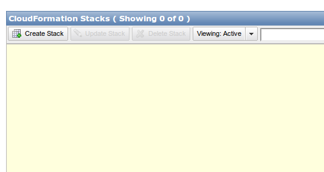
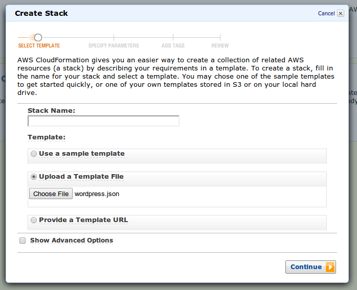

Creating a wordpress multisite install using cloudformation and ansible
========================================================

Intro
-------------------------

You may have noticed that this site recently changed over from blogger to wordpress.  In order to make this change, I setup a wordpress multisite installation.  A multisite installation is when one wordpress install lets you run multiple websites.  I like multisite because it enables me to flexibly manage multiple websites with less duplication of effort than a single wordpress installation for each website would allow me.

Wordpress multisite normally works with subdomains (ie mail.google.com), but I combined the multisite mode with domain mapping to enable top-level domains to be used for each sub-site (so, we have vikparuchuri.com).

This post will be kind of a meta-post, where I go into the details of how I set the site up.  I am not a sysadmin by trade (what am I by trade, anyways?), but some new tools make it really simple to build repeatable configurations.  I can't stress the repeatable enough.  If you setup an installation "by hand" and run a lot of manual system commands, it will be extremely hard to reproduce if you need to run another site, or if you want to backup and re-initialize your site with different hardware.  To enable the configuration steps to be repeatable, I used the following technologies:

* [EC2](http://aws.amazon.com/ec2/) is an Amazon service that lets you create or shutdown servers on an on demand basis.  It is great for deploying websites in seconds.
* [Route 53](http://aws.amazon.com/route53/) Route 53 is Amazon's DNS service.  It makes it incredibly simple to setup DNS records.
* [CloudFormation](http://aws.amazon.com/cloudformation/) is another Amazon service that lets you use templates to create resource "stacks".  These resources can be servers (EC2), databases (RDS), and so on.  This lets you easily create and manage configurable resources.  In our case, it allows us to create our server and associated resources very easily.
* [Ansible](http://www.ansibleworks.com/) is an open source project that allows for idempotent commands to be run by sshing into a server or group of servers.  In our case, it allows us to very easily configure our wordpress server.

Before we get started, please note that these steps have been tested only on Ubuntu 12.10.  It will most likely work with windows, but some steps may need to be modified.

Getting the code
-------------------------

To get started, we first need to grab the wordpress-deployment repository:

```
git clone git@github.com:VikParuchuri/wp-deployment.git
```

Git is a version control system, and github is a social coding tool.  If you haven't used git before, [github](https://help.github.com/articles/set-up-git) has some good tutorials.

The git clone command will make a new directory where you cloned it called wp-deployment.

Starting the cloudformation stack
---------------------------

After you have cloned the repository, you will be able to find the cloudformation template at `cloudformation/wordpress.json` .

We will now need to login to an existing AWS account to use this template.  See [Amazon AWS](http://aws.amazon.com/) for details on making an account.

One you login, you should be at the [management console](https://console.aws.amazon.com/console/home?#).  The management console allows you to interact with AWS resources.  In this case, we care about the [cloudformation section](https://console.aws.amazon.com/cloudformation/home).

Once you are in the cloudformation console, you will be able to click on "create stack". 

After clicking on "create stack", you will need to choose to upload the wordpress.json template.  

Once you fill in the stack name and click "next", you will come to the "specify parameters" screen.  This is where the extensibility of cloudformation comes to the fore.  This template lets you specify a few different variables.

* SSHLocation - If you want to restrict SSH access, set this.  Otherwise, leave it at the default.
* EnvironmentTag - If you want a stage or sandbox instance to test with, change this.  Otherwise, leave at prod.  This will not change anything with the instance, it will only change how the instance is tagged.  Ansible finds instances by how they are tagged (more on this later), so this is only if you want multiple types of servers with different configurations.
* ApplicationTag - Again, this is only a tag, so it only affects how the instance is discovered.  I would recommend leaving it as the default.
* KeyName - In your EC2 setup, you will need to specify keypairs that can SSH into your instances.  See the [user guide](http://docs.aws.amazon.com/AWSEC2/latest/UserGuide/generating-a-keypair.html) for more info on this.  The KeyName is the name of the keypair that you want to use.  You will need to have it registered with EC2, and the private key will need to be on your computer.
* InstanceType - How large of an [EC2 instance](http://aws.amazon.com/ec2/instance-types/#instance-details) you want to create.  I recommend not using the t1.micro, as it has not been fully tested (but if you are adventurous, feel free to test!).

Once you have set these, you will need to check the box that says "I acknowledge that this template may created IAM resources."  [IAM resources](http://aws.amazon.com/iam/) are an Amazon feature that allow for multiple user roles with various access permissions.  In this case, we are creating a user for our wordpress server that has limited access.

You can now hit "continue" through the next two screens (add tags and review).  Amazon will now get to work creating your stack!

What is in the stack?
---------------------------

While the stack is being created, let's talk about what is actually being made.

### IAM User

As I alluded to before, cloudformation is making an IAM user.  IAM gives us greater security, because we are not keeping our main AWS credentials on the server we are making.  In this case, we are making a user that can access Amazon S3 (file storage), and send email via Amazon SES.  Access to S3 allows the instance to be "bootstrapped" with some needed applications when it is created.  Basically, the application downloads some basic applications from S3 and does some initial configuration.  This makes it simpler for us down the line.  Access to SES will let our wordpress instance send email to users (if we enable it).

### EC2 Server

The template will also create a server.  This server will run wordpress, once we set everything up.  It will need to have access to a database (or run a database locally).  It will run the Ubuntu OS.

### ELB

An ELB is an elastic load balancer.  It basically redirects from an external facing URL to a group of servers.  It is generally intended to balance load.  In our case, it serves two purposes.  Amazon Route 53 (which we will go into later) only allows naked domain redirection (ie vikparuchuri.com instead of www.vikparuchuri.com) unless we use an ELB.  It also allows us to swap servers in/out on the backend however we want later. 

### Security Group

A security group determines who can access our server, and from what ports.

The database
---------------------------

You may have noticed that I did not include a database in the previous description of the stack.  This is because I wanted to make it as flexible as possible what database you use.

You can either create a database locally on the EC2 server you have just made, or make a separate database server using [Amazon RDS](http://aws.amazon.com/rds/).  In my case, I used Amazon RDS because it makes it more flexible to add/remove servers without losing data.

Feel free to use either option.  For the purposes of this tutorial, I will go with a local database, because RDS is a bit more complex to setup.

Configuring the stack
---------------------------

The stack should now have finished coming up.  If you see a red light and the status "ROLLBACK_COMPLETE", you should check "Events" under the stack detail to find the reason for the rollback.  Often, it is something like having typed a configuration setting in incorrectly.


