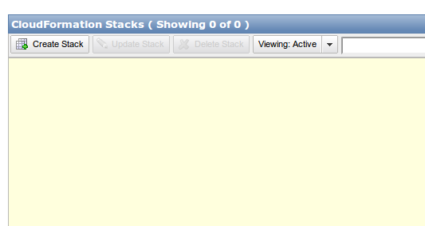

Creating a wordpress multisite install using cloudformation and ansible
========================================================

Intro
-------------------------

You may have noticed that this site recently changed over from blogger to wordpress.  In order to make this change, I setup a wordpress multisite installation.  A multisite installation is when one wordpress install lets you run multiple websites.  I like multisite because it enables me to flexibly manage multiple websites with less duplication of effort than a single wordpress installation for each website would allow me.

Wordpress multisite normally works with subdomains (ie mail.google.com), but I combined the multisite mode with domain mapping to enable top-level domains to be used for each sub-site (so, we have vikparuchuri.com).

This post will be kind of a meta-post, where I go into the details of how I set the site up.  I am not a sysadmin by trade (what am I by trade, anyways?), but some new tools make it really simple to build repeatable configurations.  I can't stress the repeatable enough.  If you setup an installation "by hand" and run a lot of manual system commands, it will be extremely hard to reproduce if you need to run another site, or if you want to backup and re-initialize your site with different hardware.  To enable the configuration steps to be repeatable, I used the following technologies:

* [EC2](http://aws.amazon.com/ec2/) is an Amazon service that lets you create or shutdown servers on an on demand basis.  It is great for deploying websites in seconds.
* [Route 53](http://aws.amazon.com/route53/) Route 53 is Amazon's DNS service.  It makes it incredibly simple to setup DNS records.
* [CloudFormation](http://aws.amazon.com/cloudformation/) is another Amazon service that lets you use templates to create resource "stacks".  These resources can be servers (EC2), databases (RDS), and so on.  This lets you easily create and manage configurable resources.  In our case, it allows us to create our server and associated resources very easily.
* [Ansible](http://www.ansibleworks.com/) is an open source project that allows for idempotent commands to be run by sshing into a server or group of servers.  In our case, it allows us to very easily configure our wordpress server.

Getting the code
-------------------------

To get started, we first need to grab the wordpress-deployment repository:

```
git clone git@github.com:VikParuchuri/wp-deployment.git
```

Git is a version control system, and github is a social coding tool.  If you haven't used git before, [github](https://help.github.com/articles/set-up-git) has some good tutorials.

The git clone command will make a new directory where you cloned it called wp-deployment.

Starting the cloudformation stack
---------------------------

After you have cloned the repository, you will be able to find the cloudformation template at `cloudformation/wordpress.json` .

We will now need to login to an existing AWS account to use this template.  See [Amazon AWS](http://aws.amazon.com/) for details on making an account.

One you login, you should be at the [management console](https://console.aws.amazon.com/console/home?#).  The management console allows you to interact with AWS resources.  In this case, we care about the [cloudformation section](https://console.aws.amazon.com/cloudformation/home).

Once you are in the cloudformation console, you will be able to click on "create stack". 


